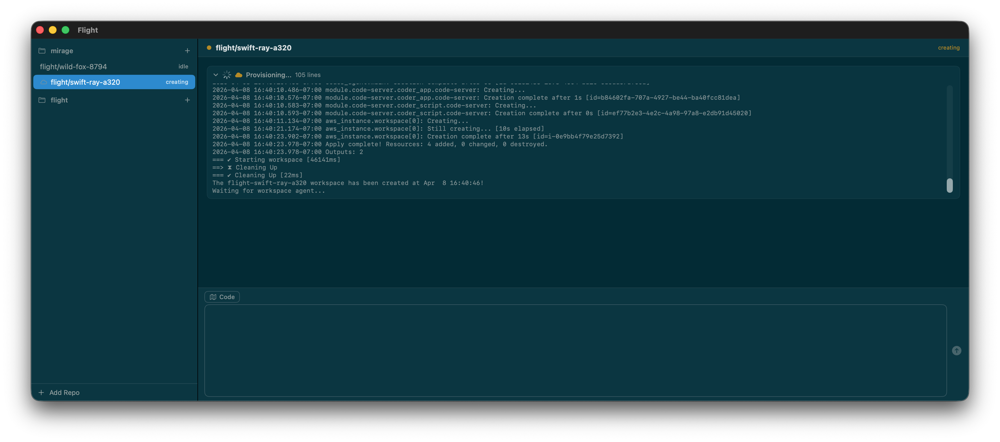

# Flight

A Mac-native GUI for orchestrating parallel Claude Code agents across local git worktrees and remote workspaces.

Inspired by [Conductor](https://conductor.build) and evolved from [inc](https://github.com/nickdirienzo/inc), an earlier experiment in software factory patterns. Flight focuses on being a practical daily driver for parallel agentic coding with native support for remote workspaces.



## What it does

- Manage multiple git repos in a sidebar
- Spin up isolated git worktrees per task, each running its own Claude Code agent
- Chat with agents in a streaming UI with collapsible tool calls and markdown rendering
- Run agents locally (sandboxed) or remotely via SSH (e.g. Coder, EC2, any machine)
- Multiple conversations per worktree with tab support
- Base16 theme engine with 6 built-in themes + import support

### Planned

- GitHub PR creation and CI status tracking per worktree
- Image paste support (Cmd+V)

## Install

Requires macOS 14+ and Swift 5.9+. No Xcode needed.

```bash
git clone https://github.com/nickdirienzo/flight.git
cd flight
./build.sh
open Flight.app
```

Or run directly:

```bash
swift run Flight
```

### Prerequisites

- [Claude Code CLI](https://docs.anthropic.com/en/docs/claude-code) (`claude`) on your PATH
- [GitHub CLI](https://cli.github.com/) (`gh`) for PR/CI features (optional)

## Usage

### Local worktrees

1. Click **Add Repo** to add a git repository
2. **Cmd+N** creates a new worktree with a random branch name and starts a Claude agent
3. Chat in the input bar, hit **Enter** to send
4. **Escape** interrupts the agent mid-turn

### Remote workspaces

1. Configure remote mode per project in **Settings > Remote** (or edit `~/flight/config.json`)
2. **Shift+Cmd+N** (or Shift+click the **+** button) opens the remote dialog
3. Select an existing workspace or provision a new one
4. Type your initial prompt and hit **Cmd+Enter**

Remote mode is backend-agnostic. You provide four scripts:

| Command | Purpose |
|---------|---------|
| `provision` | Create a workspace. Receives `{branch}`. Prints workspace name as last line. |
| `connect` | SSH prefix. Receives `{workspace}`. e.g. `coder ssh {workspace} --` |
| `teardown` | Destroy a workspace. Receives `{workspace}`. |
| `list` | Optional. Prints running workspace names, one per line. |

Example config for Coder:

```json
{
  "projects": [
    {
      "name": "my-project",
      "path": "/Users/you/code/my-project",
      "remoteMode": {
        "provision": "~/flight/my-provision-script {branch}",
        "connect": "coder ssh {workspace} --",
        "teardown": "coder delete {workspace} --yes",
        "list": "~/flight/my-list-script"
      }
    }
  ]
}
```

### Keyboard shortcuts

| Shortcut | Action |
|----------|--------|
| Cmd+N | New local worktree |
| Shift+Cmd+N | New remote worktree |
| Cmd+T | New conversation tab |
| Cmd+W | Remove worktree |
| Cmd+1-9 | Switch worktrees |
| Cmd+Enter | Restart agent |
| Cmd+. | Kill agent |
| Cmd+K | Clear chat |
| Cmd+, | Settings |
| Escape | Interrupt agent |

### Themes

Flight uses [Base16](https://github.com/tinted-theming/schemes) for theming. Built-in themes:

- System (follows macOS appearance)
- Solarized Dark / Light
- Tokyo Night
- Gruvbox Dark
- Catppuccin Mocha
- Nord

Import any Base16 `.json` theme file via **Settings > General > Import Base16 Theme**. Imported themes are saved to `~/flight/themes/`.

## Architecture

```
Sources/
  FlightApp.swift          App entry, window, keyboard shortcuts
  AppState.swift           Central @Observable state
  Theme.swift              Base16 theme engine
  Models/
    Project.swift           Repo reference + remote config
    Worktree.swift          Branch, status, conversations
    AgentMessage.swift      Parsed stream-json messages
    Conversation.swift      Per-tab agent session
  Services/
    ClaudeAgent.swift       Process lifecycle, stdin/stdout, turn management
    ConfigService.swift     ~/flight/config.json persistence
    GitService.swift        git worktree operations
    GitHubService.swift     gh CLI wrapper
    ShellService.swift      Async process runner
  Views/
    ContentView.swift       Main layout + remote prompt dialog
    SidebarView.swift       Project/worktree list
    ChatView.swift          Message list, tool groups, thinking indicator
    MessageView.swift       Chat bubbles + tool call rows
    MarkdownText.swift      Lightweight markdown renderer
    InputBarView.swift      Text input, plan mode, stop button
    SettingsView.swift      Themes, font size, remote config
```

### How agents work

Each user message spawns a new `claude -p` process with `--output-format stream-json`. Subsequent messages use `--resume <session_id>` to maintain conversation context. This one-process-per-turn model avoids the complexity of long-lived bidirectional streaming.

**Local**: Process runs directly with sandbox enabled.
**Remote**: Process runs via SSH tunnel (`coder ssh workspace -- claude -p ...`). Messages are base64-encoded for safe shell transport.

### Data storage

All data lives in `~/flight/`:

```
~/flight/
  config.json              Projects, worktrees, remote config
  chat/                    Conversation history (JSON per conversation)
  logs/                    Raw stdin/stdout logs per worktree
  themes/                  Imported Base16 theme files
  worktrees/               Git worktree directories
```

## License

MIT
